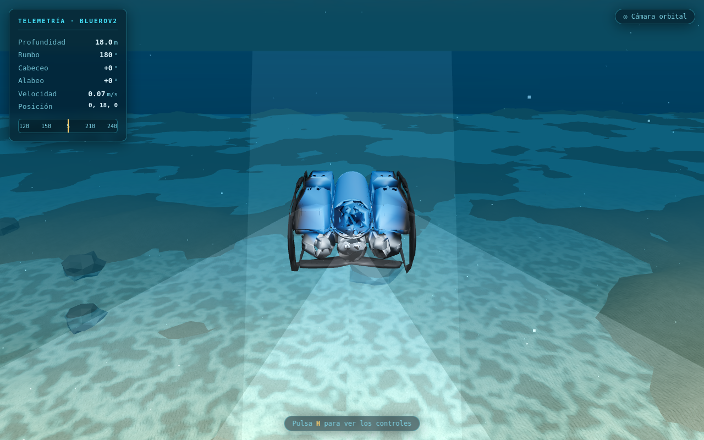

# 🌊 Underwater Simulator · BlueROV2

A **visual** marine robotics simulator built with [Three.js](https://threejs.org/).
Pilot a **BlueROV2** with **holonomic 6-DOF motion** inside a realistic underwater
environment. Designed to be deployed for free on the web and accessible from any
browser.

It does not solve exact hydrodynamics: it uses a "feel-based" physics model
(inertia + water drag) so that handling feels believable without heavy computation.



## ✨ Features

- **Real BlueROV2 model**: the vehicle's CAD geometry (STL → GLB decimated to ~272k
  triangles, ~4.9 MB) colored by region with the real colors (black HDPE frame,
  blue buoyancy foam, enclosures and thrusters). See
  [`src/robot/BlueROV2Model.js`](src/robot/BlueROV2Model.js).
- **Holonomic 6-DOF motion**: independent surge, sway, heave, yaw, pitch and roll.
- **Simple physics**: body-frame acceleration, viscous drag, neutral buoyancy and
  passive self-righting. All parameters are easy to tune in
  [`src/physics/VehiclePhysics.js`](src/physics/VehiclePhysics.js).
- **Rich underwater environment**: depth-based fog, textured seabed with relief,
  animated caustics, suspended particles, light shafts, rocks and a water surface.
- **Telemetry HUD**: depth, heading (with compass), pitch/roll, speed and position.
- **Switchable camera**: external orbital ⟷ first-person (pilot) view.
- **ROV lights** you can toggle, with visible light cones, and **bubbles** at the
  thrusters.

## 🎮 Controls

| Key | Action |
|-----|--------|
| `W` / `S` | Forward / backward (surge) |
| `A` / `D` | Strafe left / right (sway) |
| `R` / `F` | Ascend / descend (heave) |
| `Q` / `E` | Yaw left / right |
| `↑` / `↓` | Pitch nose down / up |
| `←` / `→` | Roll left / right |
| `L` | Toggle lights |
| `C` | Switch camera (orbital / pilot) |
| `H` | Show / hide help |
| Mouse | Drag to orbit · wheel to zoom (orbital mode) |

Keys can be combined freely (holonomic motion). The mapping is centralized in
[`src/controls/KeyboardController.js`](src/controls/KeyboardController.js).

## 🚀 Local usage

Requires **Node.js 18+**.

```bash
npm install
npm run dev        # dev server (open the URL Vite prints)
```

To create the production build:

```bash
npm run build      # generates dist/
npm run preview    # serves dist/ locally for testing
```

## 🌐 Free deployment

The project is **100% static** (no backend). The `dist/` folder can be uploaded to
any static host.

### GitHub Pages (included)

```bash
npm run deploy     # build + publish dist/ to the gh-pages branch
```

Then, in the GitHub repository → **Settings → Pages**, select the `gh-pages` branch.
`vite.config.js` uses `base: './'`, so it works on the Pages subpath with no extra
configuration.

A GitHub Actions workflow (`.github/workflows/deploy.yml`) is also included to build
and publish automatically on every push — just set **Settings → Pages → Source** to
"GitHub Actions".

### Netlify / Vercel / others

- Drag the `dist/` folder onto [Netlify Drop](https://app.netlify.com/drop), **or**
- connect the repository with build command `npm run build` and publish directory `dist`.

## 🗂️ Structure

```
src/
  main.js                 Bootstrap: renderer, scene, env map, animation loop
  scene/                  Ocean, lighting, caustics, particles, depth gradient
  robot/BlueROV2Model.js  Loads the real GLB, colors by region, lights, bubbles
  assets/bluerov2.glb     BlueROV2 CAD model (decimated)
  physics/VehiclePhysics  Holonomic 6-DOF kinematics (tunable parameters)
  controls/               Keyboard and camera rig (orbital / FPV)
  ui/                     Telemetry HUD and help overlay
  utils/noise.js          Simplex noise (seabed, caustics, sand) — no dependencies
```

## 🔧 Ideas to extend

- Ocean currents that push the vehicle.
- Mission objects (rings, pipes) and a timer to practice piloting.
- Gamepad/joystick support reusing the normalized 6-DOF input state.

## 📄 License

MIT.
